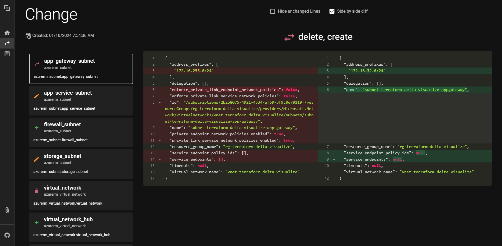

# terraform delta visualize
Yet another terraform plan visualization tool

Inspired by [terraform-visual](https://github.com/hieven/terraform-visual) i've decided to create my own tool to visualize terraform plans.
I've implemented a few features that i've missed in terraform-visual:
- [x] side by side diff of ressource changes
- [x] larger screen for comparison
- [x] easy display of delete -> create operation
- [x] timestamp of plan creation
- [x] display all variables of plan

Unimplemented feature ideas:
- [ ] display of resource dependencies
- [ ] summary of actions (counts)
- [ ] filter options for change resources
- [ ] list of resource changes will be scrollable diff stays fixed

## Usage
Upload your Terraform plan to visualize the changes.

[Try it!](https://tradermoe.github.io/terraform-delta-visualize/)

